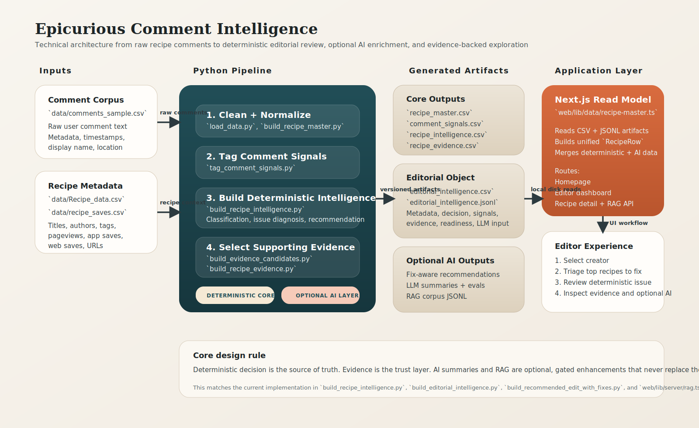
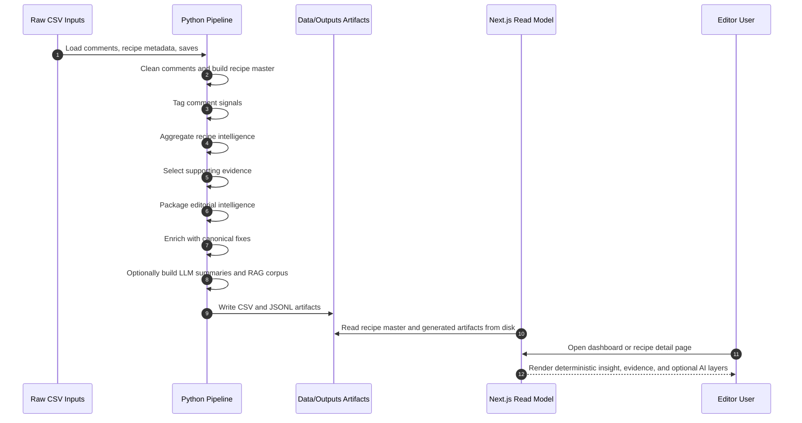
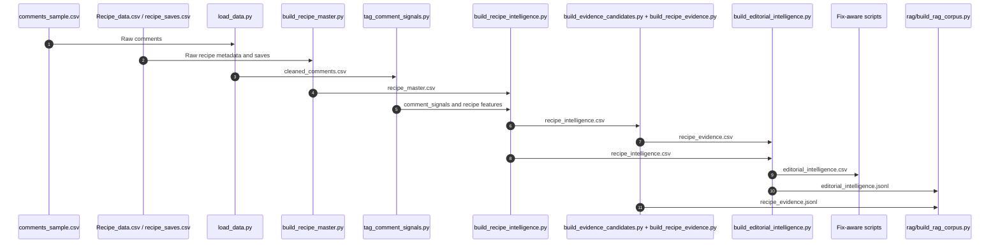
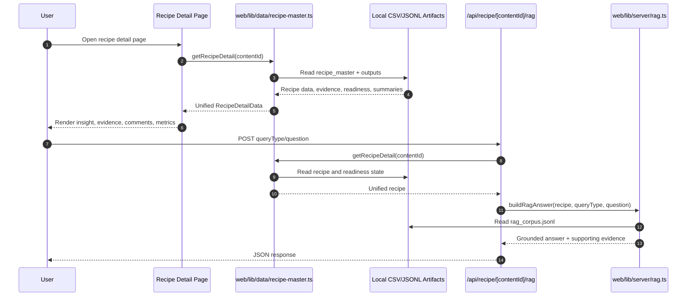

# Product Requirements Document

## Product
Epicurious Comment Intelligence

## Summary
Epicurious Comment Intelligence converts recipe comments into a deterministic editorial review system. It helps recipe editors identify which recipes deserve attention, what recurring issue users are reporting, what evidence supports that diagnosis, and what edits are most likely to improve the recipe.

The product is intentionally not a freeform AI assistant. The primary decision layer is rule-based and evidence-backed. AI is used only as an optional enhancement for summarization and evidence exploration when confidence gates are met.

## Problem
Recipe teams have large volumes of user comments, but comment review is slow, inconsistent, and difficult to scale.

Current editorial pain points:
- Important recipe failures are buried in long comment threads.
- Editors need a fast way to distinguish low-signal noise from recurring recipe problems.
- User workarounds are valuable, but they are hard to normalize into clear editorial recommendations.
- AI-only summarization is hard to trust without deterministic grounding and visible evidence.

## Goal
Build an internal workflow that lets editors:
- triage recipes by opportunity and severity
- inspect the most likely issue for a recipe
- review supporting evidence quickly
- see recurring user fixes when confidence is high
- optionally ask focused follow-up questions against grounded evidence

## Non-Goals
- Fully autonomous recipe rewriting
- Open-ended chatbot behavior that decides the recipe issue on its own
- Real-time ingestion from production systems
- End-user facing consumer product features
- Model-first classification without deterministic traceability

## Users
Primary user:
- Recipe editor / creator reviewing their portfolio

Secondary users:
- Editorial leads prioritizing high-opportunity content
- Analysts evaluating comment quality and model quality

## User Jobs
1. As an editor, I want to see which of my recipes are most worth reviewing first.
2. As an editor, I want to know the clearest recurring complaint for a recipe.
3. As an editor, I want to see a few representative comments instead of reading every comment.
4. As an editor, I want to know whether readers are consistently fixing the recipe in the same way.
5. As an editor, I want optional AI help only when the evidence is strong enough.

## Product Principles
- Deterministic decision is the source of truth.
- Evidence must remain visible and reviewable.
- AI output is optional, gated, and subordinate.
- Retrieval is for exploration, not primary diagnosis.
- Low-signal recipes should degrade safely into manual review.

## MVP Scope
Included:
- Batch comment cleaning and recipe metadata preparation
- Comment-level signal tagging
- Recipe-level issue classification and scoring
- Evidence candidate scoring and selection
- Editorial intelligence packaging into CSV and JSONL
- Fix-aware recommendation enrichment
- Dashboard and recipe detail views in Next.js
- Optional LLM summaries using OpenAI Batch API
- Optional evidence-backed RAG Q&A on recipe detail pages

Excluded from MVP:
- Automated data refresh scheduling
- Authentication / permissions
- Multi-tenant support
- Human feedback capture loop in the UI
- Direct integration with editorial CMS tooling

## Success Metrics
Primary:
- Percent of recipes with usable deterministic classification
- Percent of classified recipes with at least 2 supporting evidence comments
- Editor time-to-triage versus manual comment review
- Precision of displayed issue on manually reviewed sample sets

Secondary:
- Coverage of fix-aware recommendations
- Percent of recipes gated as ready for summary
- Percent of recipes gated as ready for RAG
- LLM evaluation scores for groundedness, correctness, actionability, and specificity

## User Experience
### Workflow
1. User lands on homepage and selects a recipe creator.
2. User sees dashboard views such as top recipes to fix, highest reach, highest intent, and high reach / low conversion.
3. User opens a recipe detail page.
4. User first sees deterministic editorial insight.
5. User then reviews supporting evidence comments.
6. User can optionally ask targeted RAG questions.
7. User can review raw comments and summary context before deciding on an edit.

### Key Screens
- Homepage creator selection
- Creator dashboard
- Recipe detail page
- RAG answer panel on recipe detail page

## Functional Requirements
### 1. Data Preparation
The system must:
- load raw comment CSV input from `data/comments_sample.csv`
- normalize key fields such as `recipe_id`, `comment_text`, `created_at`, `display_name`, and `will_prepare_again`
- load recipe metadata and save metrics from `data/Recipe_data.csv` and `data/recipe_saves.csv`
- build a one-row-per-recipe master table in `data/recipe_master.csv`

### 2. Comment Signal Tagging
The system must tag comment-level behaviors including:
- friction / problem language
- user modifications and substitutions
- repeat intent
- mixed or adaptation patterns

Current implementation is primarily regex- and heuristic-based in `src/tag_comment_signals.py` and downstream evidence scripts.

### 3. Recipe Intelligence
The system must aggregate recipe-level features and produce:
- `classification`
- `opportunity_score`
- `display_issue`
- `issue_confidence`
- `recommended_edit`
- `why_it_matters`

The recipe intelligence layer must remain deterministic and should use:
- friction score
- recoverability score
- repeat intent
- top friction phrases
- fallback issue inference when phrase evidence is absent

### 4. Evidence Selection
The system must:
- score candidate comments
- select a bounded number of representative comments per recipe
- preserve issue, fix, mixed, and adaptation evidence types
- store both text-only lists and richer evidence records

Current caps in the codebase:
- up to 2 issue comments
- up to 2 fix comments
- up to 1 mixed comment
- up to 1 adaptation comment

### 5. Editorial Intelligence Packaging
The system must output a structured editorial object with:
- `metadata`
- `decision`
- `signals`
- `evidence`
- `llm_readiness`
- `llm_input`

`outputs/editorial_intelligence.jsonl` is the canonical product-facing artifact for downstream AI and frontend consumption.

### 6. Fix-Aware Recommendation Layer
The system must:
- extract raw workaround phrases
- map them to canonical fix families
- compute fix confidence
- only let fix patterns sharpen the recommendation when confidence is medium or high

The system must not allow weak workaround evidence to override the issue diagnosis.

### 7. Optional LLM Summary Layer
The system must:
- build a compact batch payload from editorial records
- submit jobs through the OpenAI Batch API
- fetch summary results
- evaluate output quality before broad display

The UI should only show LLM summary content when evidence and evaluation gates pass.

### 8. Optional RAG Layer
The system must:
- build a recipe-level retrieval corpus from deterministic fields plus curated evidence
- support four query types: `issue`, `fix`, `mixed`, `editorial`
- return grounded answers only when the recipe is RAG-ready

The RAG answer should be synthesized from retrieved evidence and deterministic fields, not from unconstrained model generation.

## Technical Architecture
### Overview
The project is a file-based pipeline plus local web application:
- Python pipeline in `src/`
- generated artifacts in `data/` and `outputs/`
- Next.js application in `web/`

### System Sequence Diagram

### Pipeline Stages
1. `src/load_data.py`
Purpose: clean comments and load base datasets.

2. `src/build_recipe_master.py`
Purpose: merge recipe metadata, saves, and optional keyword summaries into `data/recipe_master.csv`.

3. `src/tag_comment_signals.py`
Purpose: create comment-level behavioral signals.

4. `src/build_recipe_comment_features.py`, `src/build_recipe_top_phrases.py`, `src/build_recipe_top_phrases_wide.py`, `src/aggregate_global_friction_phrases.py`
Purpose: prepare phrase and feature inputs for recipe-level aggregation.

5. `src/build_recipe_intelligence.py`
Purpose: compute the main deterministic diagnosis and prioritization layer.

Implementation notes:
- standardizes `recipe_id` across inputs
- reshapes behavioral phrase data when needed
- classifies recipes using friction, recoverability, repeat intent, and comment volume
- maps top friction phrases to normalized issues via `outputs/global_friction_phrases_labeled.csv`
- falls back to heuristic inference from modification phrases when phrase mapping is absent

6. `src/build_evidence_candidates.py`
Purpose: filter and score candidate supporting comments.

Implementation notes:
- uses regex libraries of specific issue patterns, vague negative language, fix patterns, causal cues, question filters, praise filters, and meta excludes
- constrains candidate length and count per recipe/type

7. `src/build_recipe_evidence.py`
Purpose: select a bounded set of evidence comments for each recipe and serialize both text and record forms.

8. `src/build_editorial_intelligence.py`
Purpose: merge recipe intelligence and evidence into nested JSONL and flattened CSV.

Implementation notes:
- computes engagement proxy and bucketed levels
- computes evidence strength from selected evidence count
- marks readiness for summary and RAG

9. Fix-aware scripts ending in `build_recommended_edit_with_fixes.py`
Purpose: enrich recommendation copy with canonical fix signals while preserving deterministic control.

10. `src/rag/build_rag_corpus.py`
Purpose: build retrieval chunks from editorial objects, evidence, and optional summaries.

### Pipeline Sequence Diagram

### Frontend Data Layer
The web app is server-rendered and reads local artifacts directly from disk.

Key file:
- `web/lib/data/recipe-master.ts`

Responsibilities:
- load CSV and JSONL artifacts from `../data` and `../outputs`
- normalize types into a unified `RecipeRow`
- merge deterministic intelligence, LLM outputs, and fix-aware outputs
- build editor lists, dashboard views, and recipe detail payloads

This is effectively the application’s read model.

### Frontend Screens
Key routes:
- `web/app/page.tsx`
- `web/app/editor/[editorId]/page.tsx`
- `web/app/recipe/[contentId]/page.tsx`

Recipe detail page order is intentionally:
1. Editorial insight
2. Supporting evidence
3. RAG exploration
4. Comments and additional metrics

### RAG API
Endpoint:
- `POST /api/recipe/[contentId]/rag`

Request:
- `queryType`: one of `issue | fix | mixed | editorial`
- optional `question`

Behavior:
- fetch recipe detail from local read model
- reject requests when recipe is not found, not RAG-ready, or retrieval returns insufficient evidence
- build answer text from deterministic fields plus retrieved chunks

Current implementation is lexical retrieval and rule-based answer synthesis in:
- `web/lib/server/rag.ts`

This is a lightweight RAG layer, not embedding-based semantic search.

### Recipe Detail Request Sequence Diagram

## Data Contracts
### Canonical Intermediate Artifacts
- `outputs/comment_signals.csv`
- `outputs/recipe_intelligence.csv`
- `outputs/evidence_candidates.csv`
- `outputs/recipe_evidence.csv`
- `outputs/editorial_intelligence.csv`
- `outputs/editorial_intelligence.jsonl`
- `outputs/editorial_intelligence_with_fix_aware_recommended_edit.csv`
- `outputs/llm_editor_summaries.jsonl`
- `outputs/llm_summary_eval_auto.csv`
- `outputs/rag_corpus.jsonl`

### Canonical Product Object
Each editorial record should contain:
- identity: `recipe_id`
- metadata: title, author, brand, tags, url
- decision: classification, issue block, recommended edit, why it matters
- signals: total comments, friction, modification, repeat intent, engagement proxy
- evidence: selected comment arrays and evidence counts
- readiness flags: summary/RAG readiness and evidence strength

### Schema Table: `data/recipe_master.csv`
| Field | Type | Source | Notes |
| --- | --- | --- | --- |
| `content_id` | string | `Recipe_data.csv` | Primary recipe identifier used by frontend |
| `brand` | string | `Recipe_data.csv` | Derived from `app_id` rename |
| `title` | string | `Recipe_data.csv` | Recipe title |
| `url` | string nullable | `Recipe_data.csv` | Preferred from row with URL and highest pageviews |
| `author_name` | string | `Recipe_data.csv` | Used to derive `editorId` in web layer |
| `author_id` | string nullable | `Recipe_data.csv` | Optional author identifier |
| `tags` | string | `Recipe_data.csv` | Pipe-delimited in web parsing |
| `page_views` | number | `Recipe_data.csv` | Reach metric |
| `save_sessions_app` | number | `recipe_saves.csv` | App save sessions |
| `save_sessions_web` | number | `recipe_saves.csv` | Web save sessions |
| `total_save_sessions` | number | merged/derived | App + web saves |
| `top_keywords` | string nullable | optional summary output | Pipe-delimited keywords |
| `top_phrases` | string nullable | optional summary output | Pipe-delimited phrases |
| `keyword_buckets` | string nullable | optional summary output | Pipe-delimited topic buckets |

### Schema Table: `outputs/recipe_intelligence.csv`
| Field | Type | Produced By | Notes |
| --- | --- | --- | --- |
| `recipe_id` | string | `build_recipe_intelligence.py` | Normalized recipe key |
| `classification` | enum string | `build_recipe_intelligence.py` | `High Opportunity`, `Needs Improvement`, `Needs Fix`, `Performing Well`, `Low Signal` |
| `opportunity_score` | number nullable | `build_recipe_intelligence.py` | Priority score for ranking |
| `display_issue` | string nullable | `build_recipe_intelligence.py` | UI-safe issue label |
| `top_normalized_issue` | string nullable | `build_recipe_intelligence.py` | Canonical issue |
| `top_issue_family` | string nullable | `build_recipe_intelligence.py` | Category such as flavor/moisture |
| `top_issue_phrase` | string nullable | `build_recipe_intelligence.py` | Phrase-backed evidence |
| `secondary_issue_phrase` | string nullable | `build_recipe_intelligence.py` | Secondary phrase if available |
| `issue_source` | string nullable | `build_recipe_intelligence.py` | `phrase`, `modification_inference`, `friction_inference`, etc. |
| `issue_confidence` | string nullable | `build_recipe_intelligence.py` | High/medium/low confidence |
| `display_issue_reason` | string nullable | `build_recipe_intelligence.py` | Explanation for UI label |
| `display_issue_action_state` | string nullable | `build_recipe_intelligence.py` | Drives manual-review vs action states |
| `recommended_edit` | string nullable | `build_recipe_intelligence.py` | Deterministic base recommendation |
| `why_it_matters` | string nullable | `build_recipe_intelligence.py` | Human-readable rationale |
| `total_comments` | number | aggregated | Comment volume |
| `pct_friction` | number nullable | aggregated | Friction rate |
| `pct_modification` | number nullable | aggregated | Modification/recoverability proxy |
| `pct_repeat_intent` | number nullable | aggregated | Repeat-intent signal |

### Schema Table: `outputs/editorial_intelligence.jsonl`
| Field Path | Type | Produced By | Notes |
| --- | --- | --- | --- |
| `recipe_id` | string | `build_editorial_intelligence.py` | Root identifier |
| `version` | string | `build_editorial_intelligence.py` | Currently `editorial_intelligence_v1` |
| `metadata.title` | string nullable | `build_editorial_intelligence.py` | Recipe title |
| `metadata.author` | string nullable | `build_editorial_intelligence.py` | Author/editor |
| `metadata.brand` | string nullable | `build_editorial_intelligence.py` | Brand/app |
| `metadata.tags` | string[] | `build_editorial_intelligence.py` | Normalized tag list |
| `metadata.url` | string nullable | `build_editorial_intelligence.py` | Canonical recipe URL |
| `decision.classification` | string nullable | `build_editorial_intelligence.py` | Main priority label |
| `decision.opportunity_score` | number nullable | `build_editorial_intelligence.py` | Ranking score |
| `decision.issue.display_issue` | string nullable | `build_editorial_intelligence.py` | Primary issue shown to editors |
| `decision.issue.issue_family` | string nullable | `build_editorial_intelligence.py` | Normalized issue family |
| `decision.issue.top_issue_phrase` | string nullable | `build_editorial_intelligence.py` | Primary evidence phrase |
| `decision.issue.secondary_issue_phrase` | string nullable | `build_editorial_intelligence.py` | Secondary phrase |
| `decision.issue.issue_source` | string nullable | `build_editorial_intelligence.py` | Provenance of diagnosis |
| `decision.issue.issue_confidence` | string nullable | `build_editorial_intelligence.py` | Confidence bucket |
| `decision.recommended_edit` | string nullable | `build_editorial_intelligence.py` | Deterministic recommendation |
| `decision.why_it_matters` | string nullable | `build_editorial_intelligence.py` | Editor rationale |
| `signals.total_comments` | number | `build_editorial_intelligence.py` | Total comments |
| `signals.eligible_comments` | number | `build_editorial_intelligence.py` | Comment subset used in scoring |
| `signals.pct_friction` | number nullable | `build_editorial_intelligence.py` | Friction score |
| `signals.pct_modification` | number nullable | `build_editorial_intelligence.py` | Modification/recoverability score |
| `signals.pct_repeat_intent` | number nullable | `build_editorial_intelligence.py` | Repeat intent |
| `signals.engagement_level` | string nullable | `build_editorial_intelligence.py` | Bucketed engagement proxy |
| `evidence.issue_evidence_comments` | string[] | `build_editorial_intelligence.py` | Text-only evidence list |
| `evidence.fix_evidence_comments` | string[] | `build_editorial_intelligence.py` | Workaround evidence list |
| `evidence.mixed_evidence_comments` | string[] | `build_editorial_intelligence.py` | Mixed-outcome evidence list |
| `evidence.adaptation_comments` | string[] | `build_editorial_intelligence.py` | Neutral adaptation evidence |
| `evidence.total_selected_evidence_comments` | number | `build_editorial_intelligence.py` | Selected evidence count |
| `llm_readiness.llm_ready_for_summary` | boolean | `build_editorial_intelligence.py` | Summary gate |
| `llm_readiness.llm_ready_for_rag` | boolean | `build_editorial_intelligence.py` | RAG gate |
| `llm_readiness.evidence_strength` | enum string | `build_editorial_intelligence.py` | `none`, `low`, `medium`, `high` |
| `llm_input.editorial_context` | string | `build_editorial_intelligence.py` | Compact model prompt context |
| `llm_input.reasoning_summary` | string | `build_editorial_intelligence.py` | Compact model reasoning prompt |

### Schema Table: `outputs/editorial_intelligence_with_fix_aware_recommended_edit.csv`
| Field | Type | Produced By | Notes |
| --- | --- | --- | --- |
| `recipe_id` | string | fix-aware pipeline | Join key |
| `recommended_edit_v2` | string nullable | `build_recommended_edit_with_fixes.py` | Confidence-aware upgraded recommendation |
| `recommended_edit_source` | string nullable | `build_recommended_edit_with_fixes.py` | Indicates issue-only vs fix-aware path |
| `fix_confidence` | string nullable | upstream fix aggregation | Confidence of canonical workaround pattern |
| `fix_signal_summary` | string nullable | `build_recommended_edit_with_fixes.py` | Human-readable workaround summary |
| `top_canonical_fix_1` | string nullable | upstream fix aggregation | Primary normalized fix |
| `top_canonical_fix_2` | string nullable | upstream fix aggregation | Secondary normalized fix |
| `top_fix_family_1` | string nullable | upstream fix aggregation | Primary fix family |
| `top_fix_family_2` | string nullable | upstream fix aggregation | Secondary fix family |

### Schema Table: Web Read Model `RecipeRow`
| Field | Type | Built In | Notes |
| --- | --- | --- | --- |
| `contentId` | string | `web/lib/data/recipe-master.ts` | Frontend recipe id |
| `editorId` | string | `web/lib/data/recipe-master.ts` | Slug of `author_name` |
| `title` | string | `web/lib/data/recipe-master.ts` | Display title |
| `priority` | string | `web/lib/data/recipe-master.ts` | Mirrors classification |
| `opportunityScore` | number nullable | `web/lib/data/recipe-master.ts` | Ranking score |
| `displayIssue` | string nullable | `web/lib/data/recipe-master.ts` | UI-safe issue text |
| `recommendedEdit` | string nullable | `web/lib/data/recipe-master.ts` | Uses fix-aware text when available |
| `recommendedEditV2` | string nullable | `web/lib/data/recipe-master.ts` | Explicit fix-aware recommendation |
| `whyItMatters` | string nullable | `web/lib/data/recipe-master.ts` | Explanatory rationale |
| `issueConfidence` | string nullable | `web/lib/data/recipe-master.ts` | Issue confidence |
| `fixConfidence` | string nullable | `web/lib/data/recipe-master.ts` | Fix confidence |
| `totalComments` | number | `web/lib/data/recipe-master.ts` | Comment count |
| `pctFriction` | number nullable | `web/lib/data/recipe-master.ts` | Friction metric |
| `pctModification` | number nullable | `web/lib/data/recipe-master.ts` | Modification metric |
| `pageviews` | number | `web/lib/data/recipe-master.ts` | Reach |
| `saves` | number nullable | `web/lib/data/recipe-master.ts` | Save count when supported |
| `evidence` | object nullable | `web/lib/data/recipe-master.ts` | Arrays of supporting comments |
| `llmReadiness` | object nullable | `web/lib/data/recipe-master.ts` | Summary/RAG readiness |
| `llmEditorSummary` | string nullable | `web/lib/data/recipe-master.ts` | Optional LLM summary |

## Decision Logic
### Classification
Current recipe classification in `src/build_recipe_intelligence.py` uses:
- minimum comment threshold for usable signal
- friction score
- recoverability score
- repeat-intent proportion

Current labels:
- `High Opportunity`
- `Needs Improvement`
- `Needs Fix`
- `Performing Well`
- `Low Signal`

### Issue Diagnosis
Priority order:
1. phrase-backed issue from top friction phrases
2. phrase-backed secondary issue if stronger by coverage
3. heuristic inference from modification phrases
4. low-confidence unresolved friction / manual review state

### Evidence Gating
Current readiness rules:
- summary ready if issue, fix, or mixed evidence exists
- RAG ready if at least 2 selected evidence comments exist
- evidence strength bucketed as `none | low | medium | high`

## Risks
- Rule-based phrase coverage may miss novel issue language.
- Regex-heavy evidence logic may be brittle across brands or new comment styles.
- Frontend depends on local file presence and correct run order of upstream scripts.
- The current RAG layer is retrieval-light and may underperform on paraphrased questions.
- There is no orchestration or scheduled pipeline runner yet.
- Dataset schemas appear file-based and may drift without contract tests.

## Open Questions
- What level of manual labeling is acceptable for maintaining phrase-to-issue mappings?
- Should opportunity score thresholds be editor-specific, brand-specific, or global?
- Should RAG move from lexical retrieval to embeddings from `sentence-transformers` or OpenAI embeddings?
- What editorial actions should be logged to measure whether recommendations led to recipe improvements?
- Does the team want this to remain local/offline-first, or become a service-backed internal tool?

## Recommended Roadmap
### Phase 1
- Stabilize deterministic pipeline outputs
- Add artifact contract checks and schema validation
- Document exact run order and dependencies

### Phase 2
- Improve evidence scoring quality
- Add evaluation sets for issue classification and recommendation precision
- Tighten low-signal and manual-review behavior

### Phase 3
- Productionize LLM summary gating
- Expand RAG retrieval quality
- Add feedback capture from editors

### Phase 4
- Introduce orchestration, scheduling, and observability
- Consider service-backed ingestion and persistent storage

## Engineering Recommendations
- Add a single orchestrator entry point or `Makefile`/task runner for the end-to-end build.
- Add schema assertions for all major CSV/JSONL handoffs.
- Add snapshot tests for key decision outputs from `build_recipe_intelligence.py`.
- Move regex libraries and thresholds into versioned config files where possible.
- Consider a typed backend API layer if the web app grows beyond local artifact reads.

## Appendix: Current Stack
- Python
- pandas
- numpy
- spaCy
- RapidFuzz
- sentence-transformers
- OpenAI API
- Next.js 15
- React 19
- TypeScript
